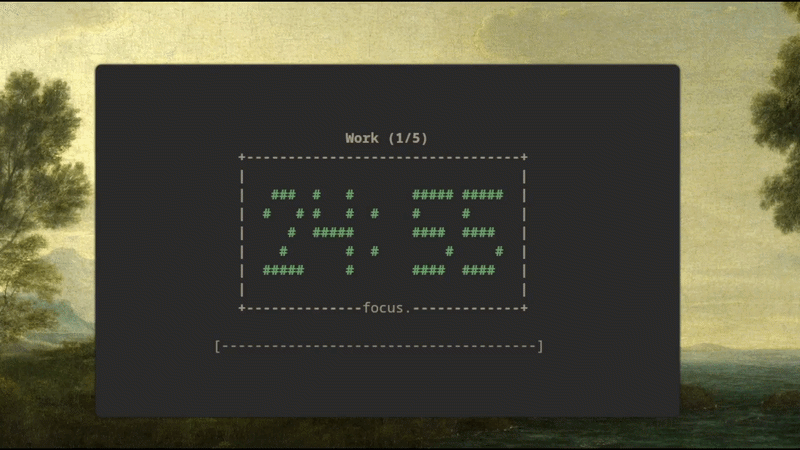

# pompy



A simple Pomodoro timer for your terminal.

## Install

`pompy` is distributed on PyPI as `pompy-timer`.

If you already have `pipx`:

```bash
pipx install pompy-timer
```

If you do not have `pipx` yet:

```bash
python3 -m pip install --user pipx
python3 -m pipx ensurepath
```

Restart your terminal, then run:

```bash
pipx install pompy-timer
```

## Quick Start

Start a standard 25-minute session:

```bash
pompy
```

Start a custom session:

```bash
pompy 15
pompy 50 "Deep work"
```

You can also use flags:

```bash
pompy --minutes 30 --label "Code review"
```

Run multiple Pomodoro cycles with automatic breaks:

```bash
pompy --cycles 4 --break 5 --long-break 15 --label "Study"
pompy -c 4 -b 5 -B 15 -l "Study"
```

Control the transition screen between phases:

```bash
pompy --transition-seconds 3
pompy --transition-wait-key
pompy --no-bell
pompy -t 3
pompy -w
```

Choose a large timer digit style:

```bash
pompy --digit-style block
pompy --digit-style outline
pompy --digit-style segment
pompy -d minimal
```

## Command Options

| Option | What It Does |
| --- | --- |
| `[minutes]` | Sets work session length in minutes (positional argument). |
| `[label]` | Adds an optional label shown during work sessions (positional argument). |
| `-m`, `--minutes` | Sets work session length in minutes. |
| `-l`, `--label` | Sets the optional work-session label. |
| `-b`, `--break` | Sets short break length in minutes. |
| `-B`, `--long-break` | Sets long break length in minutes. |
| `-c`, `--cycles` | Sets how many work sessions to run in the overall timer session. |
| `-t`, `--transition-seconds` | Sets how long transition screens are shown before the next phase starts. |
| `-w`, `--transition-wait-key` | Waits for a key press at transition screens before starting the next phase. |
| `--bell` | Enables bell notifications on phase changes. |
| `--no-bell` | Disables bell notifications on phase changes. |
| `-d`, `--digit-style` | Chooses the large timer style: `block`, `outline`, `segment`, or `minimal`. |
| `--version` | Shows the installed app version. |
| `-h`, `--help` | Shows help and all available options. |

Defaults:

- `--cycles` is `1`
- `--break` is `5` minutes
- `--long-break` is `15` minutes
- `--transition-seconds` is `2.0`

## While The Timer Runs

- `space` to pause or resume
- `q` to quit early

## Common Commands

Show help:

```bash
pompy --help
```

Show version:

```bash
pompy --version
```

Update:

```bash
pipx upgrade pompy-timer
```

Uninstall:

```bash
pipx uninstall pompy-timer
```


